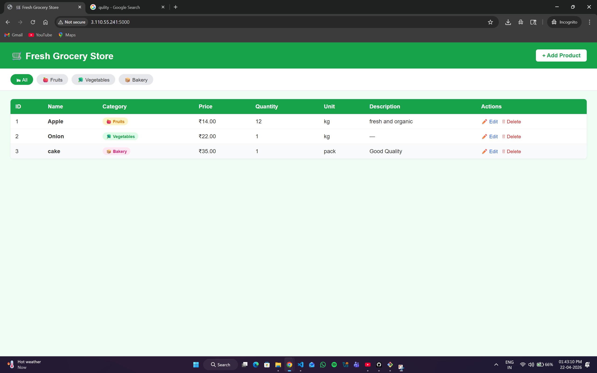
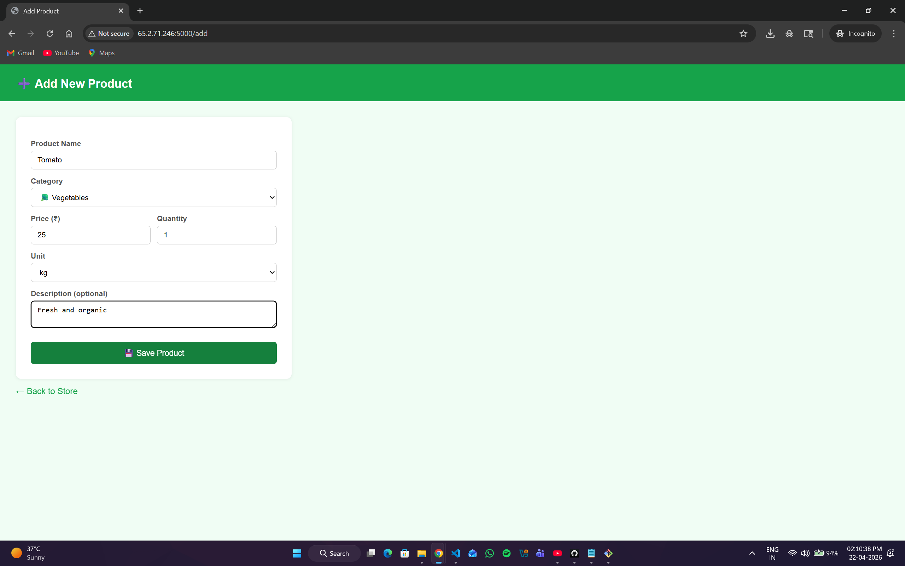
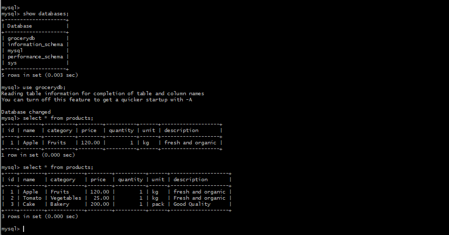

# 🛒 Fresh Grocery Store

> A Flask web application to manage grocery products (Fruits, Vegetables & Bakery) — with MySQL for storage, containerized using Docker with a custom **bridge network** for inter-container communication.

   

---

## 📋 Table of Contents

- [Overview](#-overview)
- [Features](#-features)
- [Project Structure](#-project-structure)
- [Docker Network Architecture](#-docker-network-architecture)
- [Prerequisites](#-prerequisites)
- [Getting Started](#-getting-started)
- [Manual Docker Commands](#-manual-docker-commands-without-compose)
- [API Routes](#-api-routes)
- [Database Schema](#-database-schema)
- [Screenshots](#-screenshots)
- [Common Errors](#-common-errors)
- [Author](#-author)

---

## 🔍 Overview

Fresh Grocery Store is a CRUD web application built with **Python + Flask** and **MySQL**, fully containerized with Docker. Two containers — one for Flask, one for MySQL — communicate over a custom **Docker bridge network**, keeping them isolated from other containers while allowing private inter-container communication.

---

## ✨ Features

| Feature | Description |
|---------|-------------|
| ➕ Add Product | Name, category, price, quantity, unit, description |
| 📋 View All | Table with filter tabs by category |
| 🗑 Delete | Remove product by ID with confirmation |
| 🏷 Categories | 🍎 Fruits / 🥦 Vegetables / 🍞 Bakery |
| 💾 MySQL Storage | Data persisted in MySQL container via Docker volume |
| 🌉 Bridge Network | Flask ↔ MySQL talk over private Docker network |

---

## 📁 Project Structure

```
grocery-app/
├── app.py                  # Flask app — routes, DB logic
├── requirements.txt        # Python dependencies
├── Dockerfile              # Flask container build
├── docker-compose.yml      # Multi-container orchestration
├── screenshots/            # Add screenshots here
│   ├── home.png
│   └── add.png
└── templates/
    ├── index.html          # Product list + filter
    └── add.html            # Add product form
```

---

## 🌉 Docker Network Architecture

This project uses a **custom Docker bridge network** so the Flask container and MySQL container can talk to each other securely by container name — without exposing MySQL to the outside world unnecessarily.

```
┌─────────────────────────────────────────────────┐
│            Docker Bridge Network                 │
│              (grocery_network)                   │
│                                                  │
│   ┌──────────────────┐   ┌──────────────────┐   │
│   │  grocery_flask   │   │  grocery_mysql   │   │
│   │  (Flask app)     │──▶│  (MySQL 8.0)     │   │
│   │  port: 5000      │   │  port: 3306      │   │
│   └──────────────────┘   └──────────────────┘   │
│                                                  │
└─────────────────────────────────────────────────┘
         │
    exposed to host
    http://localhost:5000
```

### How Bridge Network Works

| Concept | Explanation |
|---------|-------------|
| **Bridge network** | A private internal network created by Docker. Containers on the same bridge network can talk to each other using their **container name** as hostname |
| **Container DNS** | Flask connects to MySQL using `host=db` — Docker resolves `db` to the MySQL container's internal IP automatically |
| **Isolation** | MySQL port `3306` is only accessible inside the network — not directly exposed to your machine (unless you add `ports: 3306:3306`) |
| **`depends_on`** | Ensures MySQL container starts before Flask container |
| **Named volume** | `grocery_data` persists MySQL data even after container restart |

### In `docker-compose.yml`

```yaml
services:
  db:
    image: mysql:8.0
    networks:
      - grocery_network       # joined to bridge network

  web:
    build: .
    environment:
      MYSQL_HOST: db          # Flask uses "db" as hostname — Docker resolves it
    networks:
      - grocery_network       # same bridge network as db

networks:
  grocery_network:
    driver: bridge            # custom bridge network
```

### In `app.py`

```python
def get_db():
    return mysql.connector.connect(
        host=os.getenv("MYSQL_HOST", "db"),  # "db" = MySQL container name
        user="root",
        password="root123",
        database="grocerydb"
    )
```

> Flask does NOT connect via `localhost` or an IP address. It uses `db` — the service name defined in `docker-compose.yml`. Docker's internal DNS resolves `db` → MySQL container's private IP on the bridge network.

---

## ✅ Prerequisites

- [Docker](https://docs.docker.com/get-docker/) installed
- [Docker Compose](https://docs.docker.com/compose/) installed

---

## 🚀 Getting Started

### Option 1 — Docker Compose (Recommended)

```bash
# 1. Clone the repo
git clone https://github.com/aryakonly/two-tier-flask-mysql-docker.git
cd grocery-app

# 2. Build and start both containers
docker-compose up --build

# 3. Open browser
# http://localhost:5000
```

### Stop containers

```bash
docker-compose down
```

### Stop + delete all data (volume)

```bash
docker-compose down -v
```

---

## 🔧 Manual Docker Commands (Without Compose)

If you want to run without `docker-compose`, manually create the bridge network:

```bash
# Step 1 — Create custom bridge network
docker network create grocery_network

# Step 2 — Run MySQL container on that network
docker run -d \
  --name db \
  --network grocery_network \
  -e MYSQL_ROOT_PASSWORD=root123 \
  -e MYSQL_DATABASE=grocerydb \
  -v grocery_data:/var/lib/mysql \
  mysql:8.0

# Step 3 — Build Flask image
docker build -t grocery_flask .

# Step 4 — Run Flask container on same network
docker run -d \
  --name grocery_flask \
  --network grocery_network \
  -p 5000:5000 \
  -e MYSQL_HOST=db \
  -e MYSQL_USER=root \
  -e MYSQL_PASSWORD=root123 \
  -e MYSQL_DATABASE=grocerydb \
  grocery_flask
```

### Verify both containers are on the same network

```bash
docker network inspect grocery_network
```

---

## 🔗 API Routes

| Method | Route | Description |
|--------|-------|-------------|
| `GET` | `/` | List all products (filter by `?category=Fruits`) |
| `GET` | `/add` | Show add product form |
| `POST` | `/add` | Save new product to MySQL |
| `GET` | `/delete/<id>` | Delete product from MySQL |

---

## 🗄 Database Schema

```sql
CREATE TABLE products (
    id          INT AUTO_INCREMENT PRIMARY KEY,
    name        VARCHAR(100) NOT NULL,
    category    ENUM('Fruits', 'Vegetables', 'Bakery') NOT NULL,
    price       DECIMAL(10,2) NOT NULL,
    quantity    INT NOT NULL,
    unit        VARCHAR(20) NOT NULL,
    description VARCHAR(255)
);
```

---

## 📸 Screenshots

### 🏠 Home — Product List


### ➕ Add Product


### 🗄 MySQL Database


---

## 🐛 Common Errors

| Error | Cause | Fix |
|-------|-------|-----|
| `Can't connect to MySQL` | MySQL not ready yet | Flask retries 10x with 3s delay — wait ~30s |
| `TemplateSyntaxError` | Jinja2 inline list `['a','b']` in `for` loop | Use hardcoded `<option>` tags instead |
| Data lost after restart | No volume defined | Ensure `grocery_data` volume in compose file |
| `db` hostname not resolved | Containers on different networks | Both must be on same Docker network |
| Port 5000 in use | Another app using port | Change to `-p 5001:5000` |

---

## 👤 Author

**aryakonly** — [GitHub](https://github.com/aryakonly)

---

## 📜 License

Open source under the [MIT License](LICENSE).
